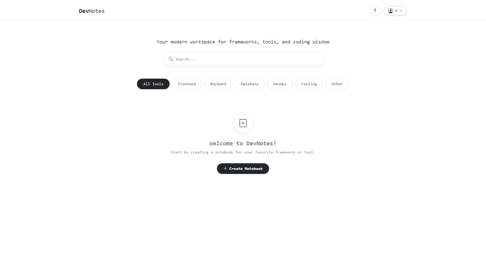
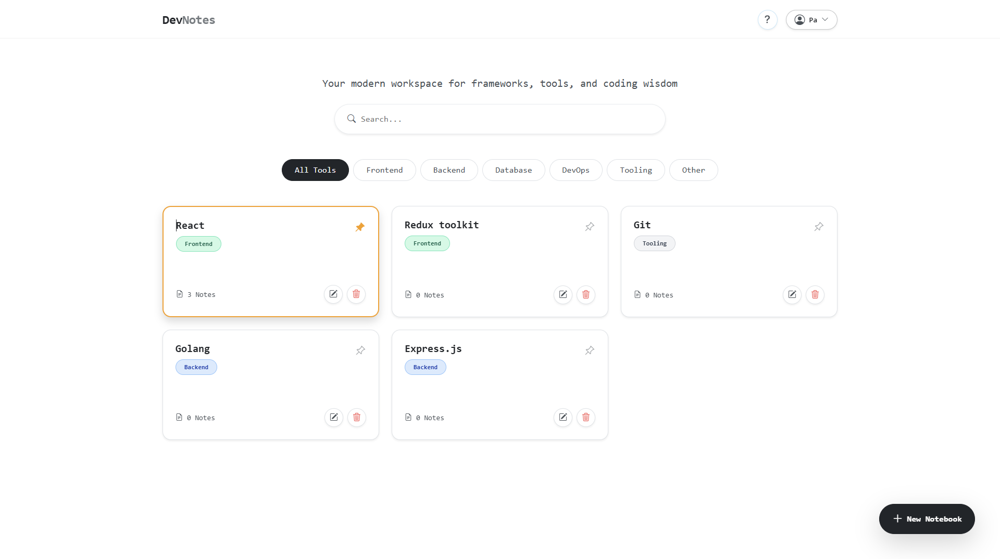
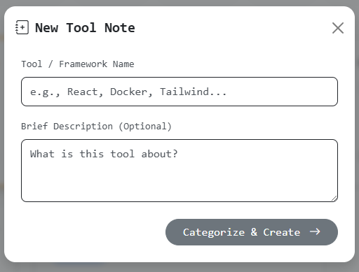
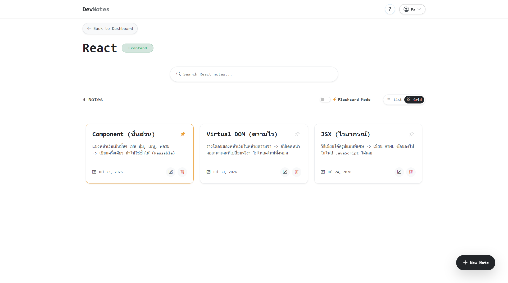
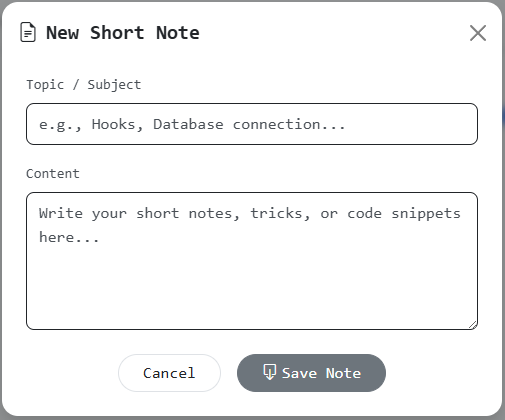
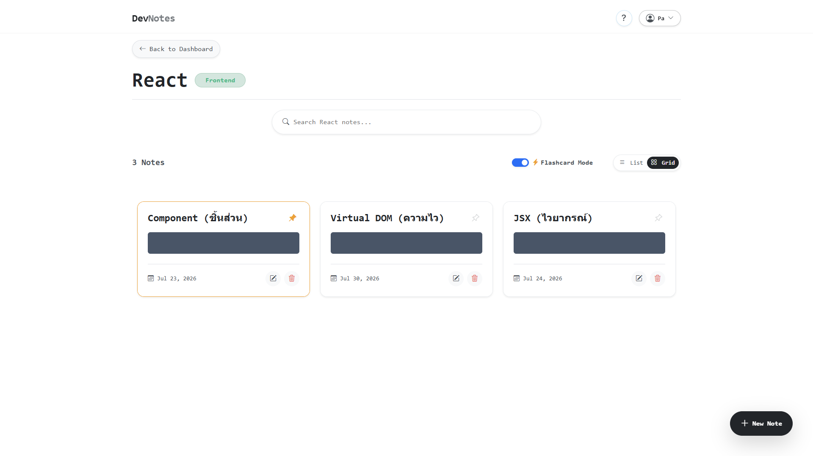
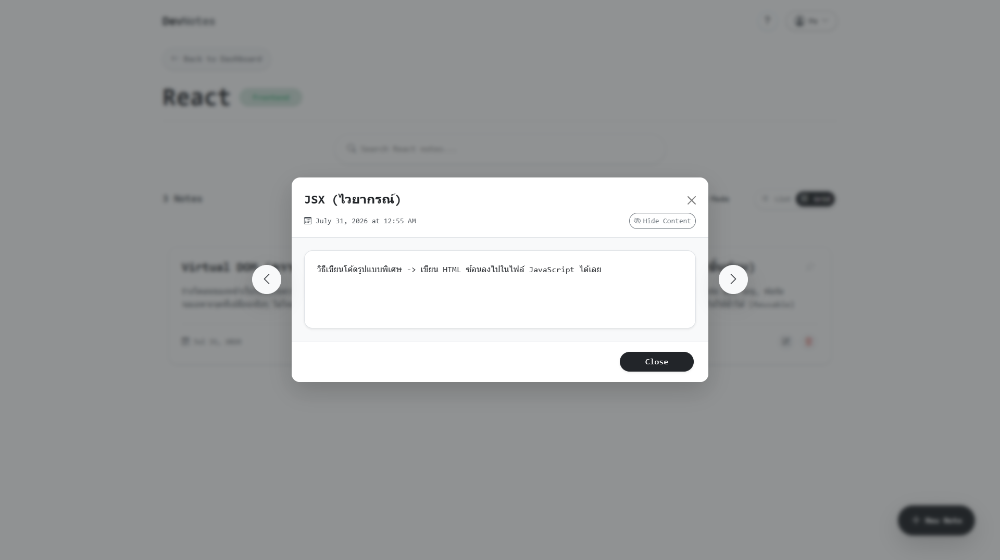
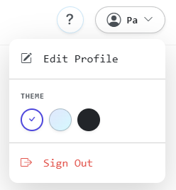

# 🚀 DevNotes

<div align="center">
  
</div>

DevNotes is a modern knowledge base application designed for developers and learners. It allows you to organize study materials, code snippets, and ideas into isolated notebooks with full Markdown support, syntax highlighting, and a built-in Flashcard mode to help you review and remember information.

---

## 📖 User Guide (How to use)

### 1. Managing Notebooks
- **Notebooks** act as folders. Create a notebook for a broad topic (e.g., `React.js Basics` or `English Vocabulary`).
- Inside each notebook, you can create multiple **Notes** to keep your knowledge organized.

<div align="center">
  
  <br><br>
  
</div>

### 2. Writing Notes (Markdown)
DevNotes supports standard Markdown, allowing you to format code and text:
- **Headings:** `# Heading 1`, `## Heading 2`
- **Text Styling:** `**bold**`, `*italic*`, `~~strikethrough~~`
- **Code Blocks:** Use triple backticks (```) followed by the language name (e.g., `javascript` or `python`) for syntax highlighting.
- **Lists:** `- item 1` or `1. item 1`

<div align="center">
  
  <br><br>
  
</div>

### 3. Flashcard Mode ⚡ (Active Recall)
When studying, toggle the **Flashcard Mode** switch at the top. 
This hides the contents of all notes by default, leaving only the titles visible. Read the title, try to recall the answer from memory, and then click to reveal it! 

<div align="center">
  
</div>

### 4. Keyboard Shortcuts ⌨️
- `Arrow Left ⬅️` / `Arrow Right ➡️`: Navigate quickly between notes in View Mode.
- `Escape`: Close modals and popups instantly.

<div align="center">
  
</div>

### 5. Themes 🎨
Customize your workspace by clicking your Profile > Theme. Choose between **Light Mode**, **Dark Mode** (easier on the eyes), or **Blue Mode** (featuring a modern translucent design).

<div align="center">
  
</div>

---

## ✨ System Features

- **📚 Clean Workspace:** Isolated notebooks for clutter-free reading.
- **💻 Syntax Highlighting:** Supports multiple programming languages with fast load times.
- **🔐 Secure Authentication:** Secure login system. Your notes are private and only visible to you.
- **🚀 High Performance:** Fast and responsive user interface.
- **🛡️ Data Protection:** Built-in security measures to keep your data safe.

---

## 🛠️ Tech Stack

- **Frontend**: React (v19), Vite, Redux Toolkit, React Router, Bootstrap 5.
- **Backend**: Node.js, Express, Jest, Morgan, Supabase SDK.
- **Database**: Supabase (PostgreSQL).

---

## 💻 Developer Setup

### Prerequisites
- Node.js (v18 or higher)
- A Supabase account and project

### Backend Setup
1. Navigate to the backend directory:
   ```bash
   cd backend
   npm install
   ```
2. Create a `.env` file in the backend directory:
   ```env
   PORT=5000
   SUPABASE_URL=your_supabase_url
   SUPABASE_SERVICE_KEY=your_supabase_service_key
   ```
3. Start the server:
   ```bash
   npm run dev
   ```
   *The API documentation is available at `http://localhost:5000/api-docs`.*

### Frontend Setup
1. Navigate to the frontend directory:
   ```bash
   cd frontend
   npm install
   ```
2. Create a `.env` file in the frontend directory:
   ```env
   VITE_SUPABASE_URL=your_supabase_url
   VITE_SUPABASE_ANON_KEY=your_supabase_anon_key
   ```
3. Start the frontend server:
   ```bash
   npm run dev
   ```

---

## 🧪 Testing
To run the automated tests for the backend (using Jest & Supertest):
```bash
cd backend
npm test
```
